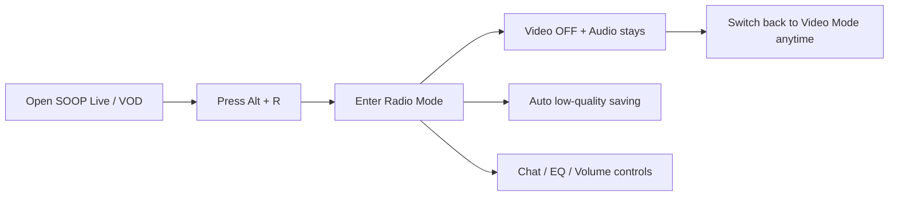

<div align="center">

# 🎧 Stream Radio Mode

### Listen to SOOP Live Streams Like a Radio

[](https://chromewebstore.google.com/detail/stream-radio-mode/nomodebfjalibapnnkfmbmempgkgjhpo)
[](LICENSE)

**Turn off the video. Keep the audio. Pretend to work.**

A Chrome extension that adds radio mode to [SOOP](https://www.sooplive.com/) live streams and VOD pages.

[Install Now](#-install-30-seconds) · [한국어](README.md)

</div>

---

## 🚀 Install (30 seconds)

### Option 1: Chrome Web Store (Recommended)

1. **[Click here](https://chromewebstore.google.com/detail/stream-radio-mode/nomodebfjalibapnnkfmbmempgkgjhpo)** to open the Chrome Web Store
2. Click **"Add to Chrome"**
3. Done! Open a [SOOP](https://www.sooplive.com/) stream and press `Alt + R`

### Option 2: Manual Install (for developers)

1. [Download ZIP](https://github.com/Hahamin/stream-radio-mode/releases/latest/download/stream-radio-mode.zip) and extract
2. Go to `chrome://extensions`
3. Enable **Developer mode** (top right)
4. Click **"Load unpacked"** → select the folder

> Works on Chrome, Edge, Whale, Brave, and any Chromium browser.

---

## 🧭 Quick Intro

The easiest way to think about this extension:

- Open a SOOP live stream or VOD.
- Press `Alt + R`.
- The video is hidden, but audio keeps playing.
- If you want the picture back, press `Switch to Video Mode`.



### Great for

- listening while working or studying
- reducing bandwidth and battery use
- treating VOD like an audio-first replay
- hiding the screen quickly when someone walks by

---

## ✨ Features

### 🎧 Radio Mode — `Alt + R`

Turns off video, keeps audio, and now adds a **speech-focused EQ** you can toggle inside radio mode.

- Streamer profile, name, stream title
- Viewer count, stream duration (live sync)
- Volume control, favorite, like buttons
- Speech EQ toggle + 3 presets (`Clarity`, `Bass Cut`, `Night`)
- Chat panel + list panel (dark theme)

### 🎞 VOD Radio Board

On VOD pages, the overlay now focuses on **current time / total length / seek bar** instead of showing a large video card.  
Hover the seek bar to see a thumbnail preview, and click to jump to that point.

| When you want to watch | When you mainly want to listen |
|:---|:---|
| Normal video mode | VOD radio board |
| video + audio | audio-first + seek bar |
| keep eyes on the screen | preview only when needed |

### 🕶 Stealth Mode — `Alt + B`

Disguises the tab as **"Google Docs"** — changes title, favicon, and auto-switches to another tab. Audio keeps playing.

### 📉 Auto Bandwidth Saving

Radio mode automatically shifts to a **stability-first low quality** profile, then only drops further when the buffer looks healthy.

```
1080p (~5-8 Mbps)  →  adaptive 540p/360p  📉 major bandwidth savings
```

### 🎙 Speech EQ (Radio Mode Only)

Uses Web Audio API filters only while radio mode is active, trimming muddy lows and lightly lifting the voice range.

- `Clarity`: balanced default preset
- `Bass Cut`: stronger low-end cleanup
- `Night`: softer highs for longer listening sessions

---

## ⌨️ Shortcuts

| Key | Action |
|:---:|:---|
| `Alt + R` | Toggle Radio Mode |
| `Alt + B` | Toggle Stealth Mode |
| `Alt + M` | Minimize Window |
| `Alt + ↑` | Volume up by 5% |
| `Alt + ↓` | Volume down by 5% |
| `Alt + 0` | Mute / restore previous volume |

---

## ❓ FAQ

**Q: Does it actually reduce bandwidth?**
> Yes. It switches the actual stream quality to LOW, not just hiding the video.

**Q: Can I hear audio in stealth mode?**
> Yes! Only the tab title and favicon change. Audio keeps playing.

---

## 🧪 Validation

- Automated: run `npm test` to check JavaScript syntax for tracked source files.
- Manual smoke 1: on non-live SOOP pages, the popup should show unsupported status and `Alt + R` / `Alt + B` should do nothing.
- Manual smoke 2: on a live page, the `🎧` button should appear and radio mode should lower quality once and restore it once when toggled off.
- Manual smoke 3: while radio mode is on, moving to another SOOP stream in the SPA should rebind streamer info, toggle button, volume sync, and chat UI to the new player.
- Manual smoke 4: stealth mode and minimize mode should still toggle off correctly after the extension service worker restarts.
- Manual smoke 5: with multiple browser windows open, stealth mode tab switching and minimize mode should affect only the window that sent the request.
- Manual smoke 6: rapid radio mode toggles should leave stream quality matching the final user action.
- Manual smoke 7: while radio mode is on, Speech EQ toggles and preset cycling should update immediately without interrupting playback.

---

## 🤝 Contributing

Bug reports, feature requests, and PRs are welcome!

- [Open an issue](https://github.com/Hahamin/stream-radio-mode/issues)
- Fork → Branch → PR

---

<div align="center">

**⭐ Star this repo if you find it useful!**

MIT License · Made with 🎧

</div>
