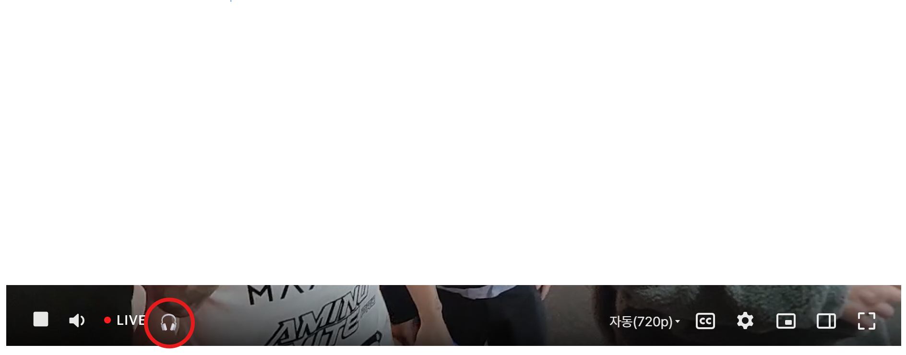
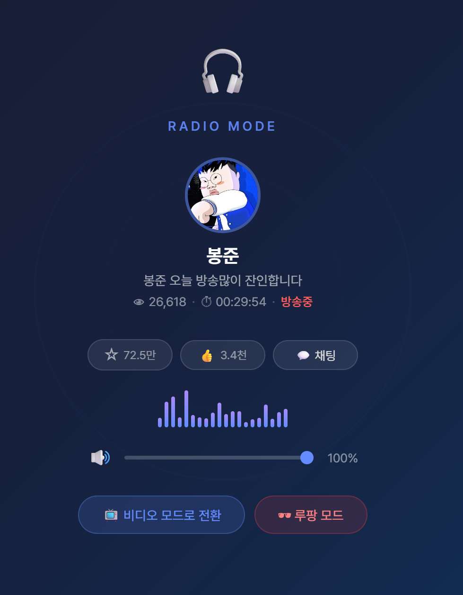
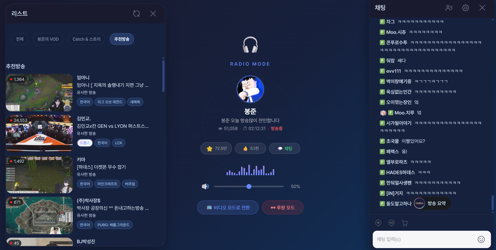

<div align="center">

# Stream Radio Mode

### SOOP Radio Mode + Multiview (Chzzk · SOOP · Twitch · YouTube)

[](https://chromewebstore.google.com/detail/stream-radio-mode/nomodebfjalibapnnkfmbmempgkgjhpo)
[](LICENSE)

**Hide the video for a while. Keep the audio comfortable. Watch multiple streams at once.**

Stream Radio Mode is a Chrome extension for [SOOP](https://www.sooplive.com/) live streams and VOD pages. It gives you radio mode, sleep mode, stealth mode, speech EQ, chat/list panels, bandwidth saving, and keyboard shortcuts. Starting with v1.6.0, **Multiview** lets you watch Chzzk, SOOP, Twitch, and YouTube streams simultaneously.

[Install](#install) · [First Use](#first-use) · [Multiview](#multiview) · [Features](#features) · [Shortcuts](#shortcuts) · [한국어](README.md)

</div>

---

## At a Glance

| Feature | What it does | Good for |
|:---|:---|:---|
| **Multiview** | Watch Chzzk, SOOP, Twitch, and YouTube streams side by side | watching multiple streamers at once |
| **Audio Mixer** | Per-stream volume, mute, solo, and hover-follow (only the hovered tile plays sound) | mixing several streams or picking one to listen to |
| **Multi Radio** | Hides every video in Multiview and keeps only the audio | listening to several streamers like radio |
| Radio Mode | Hides video and keeps audio playing | listening while working or studying |
| Sleep Mode | Stops automatically when a live stream or VOD ends | leaving a stream on before sleep |
| VOD Radio Board | Turns VOD into a time/seek-bar focused audio screen | listening to replays like podcasts |
| Bandwidth Saving | Lowers video quality while radio mode is on | reducing data, heat, and battery use |
| Speech EQ | Makes voices a bit clearer | muddy audio or quiet nighttime listening |
| Chat/List Panels | Keeps chat and recommendation lists usable | following chat without the video |
| Stealth Mode | Disguises the tab title/favicon and switches tabs | quickly reducing screen exposure |
| Minimize Mode | Minimizes the current browser window | leaving audio on with the window out of the way |
| Media Keys | Control playback with keyboard media keys and Bluetooth earbuds | hands-free control while multitasking |
| Global Shortcuts | `Alt+Shift+R` etc. work from any tab | toggling radio/stealth while on another tab |
| Clipboard/Selection Unlock | Automatically unblocks copy, paste, text selection, and right-click | when Ctrl+C/V, drag-select, or right-click is blocked on SOOP |
| Health Badge | Shows a red `!` badge when SOOP changes break a feature | catching silent breakage early |

---

## Install

### Option 1. Chrome Web Store

1. Open the [Chrome Web Store listing](https://chromewebstore.google.com/detail/stream-radio-mode/nomodebfjalibapnnkfmbmempgkgjhpo).
2. Click **Add to Chrome**.
3. Open a SOOP live stream or VOD.
4. Press `Alt + R` or click the headphone button in the player.

It works on Chromium-based browsers such as Chrome, Edge, Whale, and Brave.

### Option 2. Manual install

Use this if you want to load the release ZIP yourself.

1. Download and extract the [latest ZIP](https://github.com/Hahamin/stream-radio-mode/releases/latest/download/stream-radio-mode.zip).
2. Open `chrome://extensions`.
3. Enable **Developer mode**.
4. Click **Load unpacked**.
5. Select the extracted folder.

---

## First Use

### 1. Turn on Radio Mode

1. Open a SOOP live stream or VOD page.
2. Click the headphone button in the player or press `Alt + R`.
3. The video is hidden, but audio keeps playing.
4. Click **Switch to Video Mode** when you want the original view back.

<p align="center">
  
</p>

### 2. Use the extension popup

Click the extension icon in the browser toolbar.

- **Radio Mode**: toggles radio mode for the current tab.
- **Auto Radio**: automatically enters radio mode when opening a supported SOOP page.
- **Sleep Mode**: stops automatically when a live stream or VOD ends.
- **Stealth Mode**: disguises the tab title/favicon and switches away.
- **Minimize Mode**: minimizes the current browser window.
- **Supported sites**: enables or disables SOOP support.
- **Shortcuts**: enables shortcuts and shows a shortcut guide.

### 3. Control everything from the radio overlay

The radio overlay includes:

- volume slider
- favorite, like, and chat buttons
- speech EQ toggle
- EQ preset cycling
- sleep mode ON/OFF
- stealth mode
- switch back to video mode

<p align="center">
  
</p>

---

## Multiview

Multiview (added in v1.6.0) lets you watch Chzzk, SOOP, Twitch, and YouTube streams side by side in a single tab.

### Getting Started

1. Click the **📺 멀티뷰 (Multiview)** button in the extension popup.
2. Add streams in two ways:
   - **🔍 Browse**: Pick from live Chzzk/SOOP channel listings
   - **+ Add**: Enter a URL or channel ID directly

### Supported Platforms

| Platform | Input | Example |
|:---|:---|:---|
| Chzzk | Channel URL or 32-char channel ID | `chzzk.naver.com/live/abcd1234...` |
| SOOP | Stream URL or BJ ID | `sooplive.com/bjid` or `bjid` |
| Twitch | Channel URL or `t:username` | `twitch.tv/user` or `t:user` |
| YouTube | Live URL, `y:videoID`, or a channel URL (current live resolved automatically) | `youtube.com/live/...`, `y:abc123`, `youtube.com/@channel/live` |

### Browse Panel

Click **🔍 Browse** to open the live channel sidebar on the left.

- Switch between **Chzzk** and **SOOP** tabs for popular live streams
- Search by streamer name or stream title
- Click a channel card to add it instantly

### Audio Mixer

Hover a tile to reveal a volume slider, mute, and solo (`S`) button in the bottom-left corner. The **🎚 Mixer** toolbar button opens a panel with one row per stream.

- **Per-stream volume/mute**: Controls the platform player directly, so changes made inside the player show up on the slider too.
- **Solo**: Keeps one stream audible and mutes the rest. Press again to release.
- **Hover follow**: When enabled, only the tile under your mouse plays sound.
- **Volume memory**: Per-channel volume is saved and restored the next time you add that channel.
- Streams silenced by the browser's autoplay policy show a **sound off** notice on the tile; click it to unmute.

| Key | Action |
|:---:|:---|
| `1` – `9` | Solo / unsolo that stream |
| `0` | Clear solo |
| `M` | Toggle mute all |
| `H` | Toggle hover follow |
| `R` | Toggle Multi Radio |
| `X` | Open / close the mixer panel |

### Multi Radio

The **🎧 Radio** toolbar button covers every video and leaves just the streamer name and volume controls—Radio Mode for Multiview, for listening to several streams at once.

- Video is only hidden, not stopped, so this does not save bandwidth.
- Twitch's player pauses when it detects it is covered, so Twitch tiles keep a small preview instead. For the same reason, Twitch tiles always show their label and controls in a strip below the video rather than on top of it.

### Other Features

- **Layout**: Auto (optimal 16:9) / Horizontal / Vertical / Focus mode
- **Mute All**: Mute or unmute every stream at once
- **Chat**: Show the selected stream's chat in a right-side panel
- **URL state**: Added streams are saved in the URL hash—refresh-safe
- **Chzzk wide**: Chzzk tiles drop the site header, sidebar, and chat and show only the player

> **Permissions note**: On first use, Multiview asks once for access to the Chzzk, SOOP, Twitch, and YouTube domains plus script injection. These are used to lift embed-blocking headers, call the live-listing APIs, and inject an audio bridge into the Chzzk/SOOP players (which have no volume API). No extra permissions are shown at install time.

---

## Features

### Radio Mode

Radio Mode is the main feature. It hides the video surface and leaves an audio-first overlay with stream information and controls.

The overlay shows:

- streamer profile, name, and title
- viewer count
- live duration or VOD playback time
- live/VOD state
- volume, favorite, like, and chat buttons
- speech EQ, preset, sleep mode, and stealth controls

When radio mode turns off, the extension restores video opacity, quality, EQ attachment, chat/list panels, and page scroll lock as cleanly as possible.

### Sleep Mode

Sleep Mode is for leaving a stream or replay on without accidentally continuing forever.

On live streams:

- detects when SOOP moves from live playback toward VOD/replay state
- exits radio mode and stops playback
- keeps the video muted so audio does not leak if the player resumes
- tries to return to the original live URL when SOOP redirects to VOD

On VOD pages:

- detects the end of the replay
- pauses playback
- closes the overlay and restores the video state

You can toggle Sleep Mode in two places:

- the extension popup
- the **Sleep Mode ON/OFF** button inside the radio overlay

### VOD Radio Board

VOD pages use a replay-focused radio overlay.

- current time and total duration
- seek bar
- click-to-seek
- hover preview when a thumbnail/frame is available
- audio-first layout without needing to watch the video continuously

<p align="center">
  
  <br>
  <em>Radio Mode with chat and list panels</em>
</p>

### Automatic Bandwidth Saving

Radio Mode lowers the actual player quality instead of only hiding the video.

```text
high-quality video  ->  stable low/adaptive quality  ->  audio keeps playing
```

When you return to video mode, the extension attempts to restore the previous live/VOD quality state.

### Speech EQ

Speech EQ is a radio-mode-only audio filter using the Web Audio API. It trims muddy low frequencies and lightly lifts voice clarity.

| Preset | Description |
|:---|:---|
| Clarity | balanced default |
| Bass Cut | stronger low-end cleanup |
| Night | softer long-session listening |

### Chat and List Panels

Radio Mode can still show SOOP chat.

- The **Chat** button opens chat in a dark floating/embedded panel.
- The list panel can appear on the left for SOOP recommendations/lists.
- If you click an internal SOOP stream link from chat/list, radio mode can rebind to the new player.

### Clipboard/Selection Unlock

SOOP blocks paste in the chat input, and some areas also block copy, text selection, and right-click. This extension automatically unblocks all of them:

- **Paste (Ctrl+V)**: works normally in chat input
- **Copy (Ctrl+C)**: select and copy text works normally
- **Text selection**: drag to select text anywhere
- **Right-click menu**: context menu shows normally

It works on every SOOP page regardless of whether radio mode is on.

### Stealth Mode

Stealth Mode reduces what is visible in the browser chrome.

- changes the tab title to look like a document
- changes the favicon to a document-style icon
- switches to another tab when possible
- keeps audio playing

<p align="center">
  
</p>

### Minimize Mode

Minimizes the current browser window while audio keeps playing.

### Media Keys (Media Session)

When radio mode is active, the streamer name and title are registered with the browser media session.

- Keyboard media keys (play/pause) and Bluetooth earbud buttons work.
- The stream also appears in Chrome's media hub (the note icon next to the address bar).

### Health Badge

If SOOP changes its site structure and breaks part of the extension, you get told instead of silent failure.

- The extension periodically checks player binding and the quality-control API.
- On failure, the toolbar badge turns into a red `!` and the popup explains what broke.

---

## Shortcuts

Page shortcuts only work on supported SOOP live/VOD pages. You can disable shortcuts in the popup.

| Shortcut | Action | Details |
|:---:|:---|:---|
| `Alt + R` | Toggle Radio Mode | enter radio mode or return to video mode |
| `Alt + B` | Toggle Stealth Mode | disguise the tab and switch away |
| `Alt + M` | Minimize Window | minimize the current browser window |
| `Alt + Up` | Volume up | increase volume by 5% |
| `Alt + Down` | Volume down | decrease volume by 5% |
| `Alt + 0` | Mute/restore | mute or restore the previous volume |

Global shortcuts work from any tab. You can rebind them at `chrome://extensions/shortcuts`.

| Shortcut | Action |
|:---:|:---|
| `Alt + Shift + R` | Toggle Radio Mode (anywhere in the browser) |
| `Alt + Shift + B` | Toggle Stealth Mode (anywhere in the browser) |

---

## Suggested Workflows

### Listening to live streams while working

1. Open a SOOP live stream.
2. Press `Alt + R`.
3. Turn on Speech EQ if voices need more clarity.
4. Turn on Sleep Mode if you want playback to stop when the stream ends.
5. Use `Alt + B` if you want the tab disguised.

### Listening to VOD before sleep

1. Open a SOOP VOD.
2. Press `Alt + R`.
3. Turn on Sleep Mode in the popup or overlay.
4. Seek to the part you want.
5. Playback stops when the VOD ends.

---

## Troubleshooting

**The radio button does not appear.**

- Make sure you are on a SOOP live or VOD page.
- Refresh the page.
- Check that **Supported sites > SOOP** is enabled in the popup.

**Shortcuts do not work.**

- Make sure the SOOP page is the active tab.
- Check that shortcuts are enabled in the popup.
- Another browser or OS shortcut may be using the same key.

**There is no sound.**

- Press `Alt + 0` to check mute/restore.
- Check the radio overlay volume slider.
- Check the SOOP player's own mute state.

**Auto Radio suddenly stopped working.**

- Check that **Auto Radio** is still enabled in the popup. Extension updates or browser data cleanup can reset it.
- Pages opened before a stream goes live also auto-apply once the stream starts (v1.5.0+).

**The extension icon shows a red `!` badge.**

That means a SOOP site change broke part of the extension. Open the popup to see which feature is affected. If a page refresh does not fix it, please open an issue.

**Multiview tiles are blank or the volume sliders are disabled.**

- Site access has not been granted yet. Click the **Grant permission** banner at the top or the **+ Add** button; the tiles reload once permission is granted.
- Chzzk/SOOP sliders turn on after the audio bridge finds the video element inside the player, which happens automatically once an ad ends or the stream starts.

**It stopped working after a SOOP update.**

SOOP's real DOM and player APIs can change. Please open a [GitHub issue](https://github.com/Hahamin/stream-radio-mode/issues) with the URL, browser, and exact action that failed.

---

## Contributing

Bug reports, feature requests, and PRs are welcome.

- [Open an issue](https://github.com/Hahamin/stream-radio-mode/issues)
- Fork -> Branch -> PR
- Release automation: [docs/chrome-web-store-api.md](docs/chrome-web-store-api.md)

---

## Version History

### v1.7.0

- **Audio Mixer**: per-stream volume, mute, solo, hover follow, mixer panel, number-key solo
- **Multi Radio**: hide Multiview video and keep the audio
- Player control on all four platforms (Twitch/YouTube postMessage, Chzzk/SOOP frame bridge)
- Fixed Twitch and YouTube embeds being blocked inside the extension page
- Chzzk tiles now show only the player, without the site UI
- Add the current live stream from a YouTube channel URL (`@channel/live`)
- Fixed the SOOP player handshake protocol (streamer name now shows)

### v1.6.0

- **Multiview**: Watch Chzzk, SOOP, Twitch, and YouTube side by side (optimal 16:9 grid layout)
- **Browse panel**: Live channel listings and search for Chzzk/SOOP
- **Clipboard/selection unlock**: Copy, text selection, and right-click unlock in addition to paste
- URL hash state preservation, mute all, chat panel, focus mode
- Optional permissions — no new install-time permission warnings

### v1.5.1

- Automatically unblock paste (Ctrl+V) in the chat input

### v1.5.0

- Speech EQ (clarity / bass-cut / night presets)
- Sleep Mode (auto-stop on live end or VOD finish)
- VOD Radio Board (seek bar, time display, thumbnails)
- Automatic bandwidth saving (adaptive quality control)
- Chat/list panel dark theme
- Health badge
- Media key and Bluetooth earbud support
- Stealth Mode and Minimize Mode
- Global shortcuts (`Alt+Shift+R`, `Alt+Shift+B`)

### v1.4.0

- VOD Radio Board (playback controls)

### v1.3.0

- Radio mode stabilization, initial Speech EQ

### v1.2.0

- sooplive.com domain support
- CWS automated release

### v1.1.0

- List panel improvements, core engine hardening

### v1.0.0

- Initial release: SOOP radio mode

---

<div align="center">

**Star this repo if you find it useful.**

MIT License

</div>
