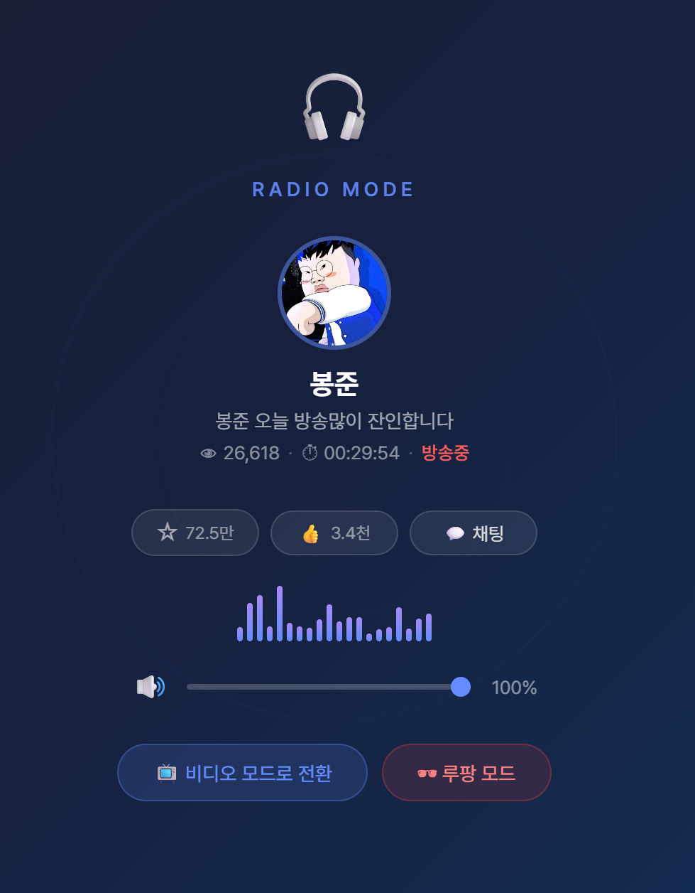
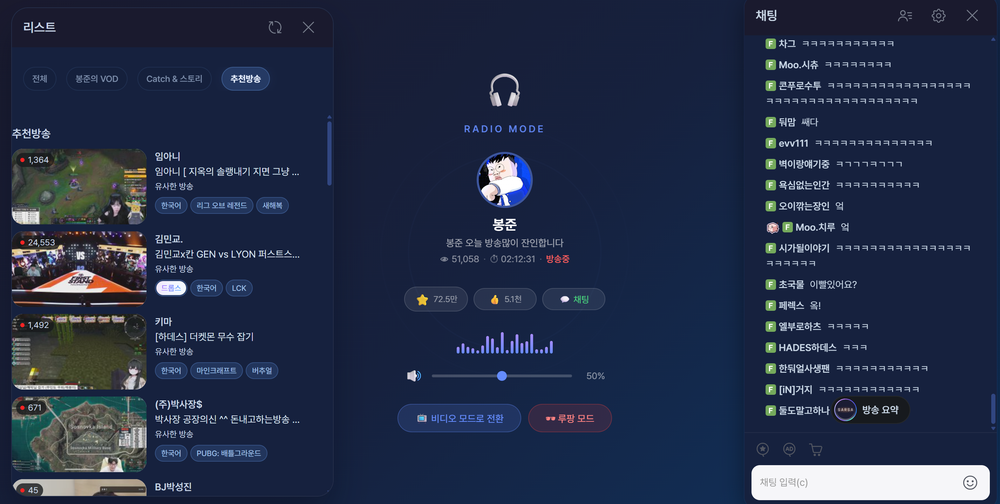

<div align="center">

# 🎧 Stream Radio Mode

### 숲(SOOP) 라디오 모드 크롬 확장 프로그램

[](https://chromewebstore.google.com/detail/stream-radio-mode/nomodebfjalibapnnkfmbmempgkgjhpo)
[](LICENSE)

**영상은 끄고, 소리만 듣고, 일하는 척하자.**

숲(SOOP) PC 방송을 라디오처럼 들을 수 있는 크롬 확장 프로그램입니다.

[바로 설치하기](#-설치-30초) · [English](README.en.md)

</div>

---

## 🚀 설치 (30초)

### 방법 1: 크롬 웹스토어 (추천)

1. **[여기 클릭](https://chromewebstore.google.com/detail/stream-radio-mode/nomodebfjalibapnnkfmbmempgkgjhpo)** → Chrome Web Store 열림
2. **"Chrome에 추가"** 버튼 클릭
3. 끝! [숲](https://www.sooplive.com/) 방송 켜고 `Alt + R` 누르면 라디오 모드

### 방법 2: 직접 설치 (개발자용)

1. [ZIP 다운로드](https://github.com/Hahamin/stream-radio-mode/releases/latest/download/stream-radio-mode.zip) 후 압축 해제
2. 크롬 주소창에 `chrome://extensions` 입력
3. 우상단 **개발자 모드** 켜기
4. **"압축 해제된 확장 프로그램을 로드합니다"** 클릭 → 폴더 선택

> Chrome, Edge, Whale, Brave 등 크로미움 브라우저 모두 됩니다.

---

## ✨ 이런 게 됩니다

### 🎧 라디오 모드 — `Alt + R`

영상 끄고 소리만 나옵니다. 인터넷 사용량도 크게 줄고, 이제 **대사 중심 EQ**까지 바로 켤 수 있습니다.

<p align="center">
  
</p>

- 스트리머 정보 (프로필, 이름, 방송 제목)
- 시청자 수, 방송 시간 실시간 표시
- 볼륨 조절, 즐겨찾기, 좋아요
- 대사 중심 EQ 토글 + 프리셋 3종 (`선명`, `저음컷`, `야간`)
- 채팅창 + 리스트 패널 (다크 테마)

<p align="center">
  
  <br>
  <em>▲ 라디오 모드 + 채팅 + 리스트</em>
</p>

### 🕶 루팡 모드 — `Alt + B`

탭 제목이 **"Google Docs - 업무 보고서.docx"** 로 바뀝니다. 파비콘도 📄 모양으로 위장. 소리는 계속 나옵니다.

<p align="center">
  
</p>

| 적용 전 | 적용 후 |
|:---|:---|
| 탭에 "숲 - BJ이름" | "Google Docs - 업무 보고서.docx" |
| 숲 로고 파비콘 | 📄 Docs 아이콘 |
| 방송 화면 노출 | 자동으로 다른 탭 전환 |

### 📉 대역폭 절약 (자동)

라디오 모드 켜면 자동으로 **안정 위주 저화질**로 전환되고, 버퍼가 충분할 때만 더 낮은 화질을 시도합니다.

```
1080p (~5-8 Mbps)  →  540p/360p 적응형  📉 대역폭 대폭 절약
```

### 🎙 대사 중심 EQ (라디오 모드 전용)

라디오 모드 안에서만 Web Audio EQ를 적용해 저역을 줄이고 말소리 대역을 살짝 올립니다.

- `선명`: 가장 무난한 기본 프리셋
- `저음컷`: 먹먹한 방송에서 저역을 더 정리
- `야간`: 고역 자극을 줄이고 편하게 듣기

---

## ⌨️ 단축키

| 키 | 기능 |
|:---:|:---|
| `Alt + R` | 라디오 모드 켜기/끄기 |
| `Alt + B` | 루팡 모드 켜기/끄기 |
| `Alt + M` | 창 최소화 |

또는 플레이어 좌하단 🎧 버튼을 클릭하세요.

<p align="center">
  
</p>

---

## ❓ FAQ

**Q: 라디오 모드에서 진짜 데이터가 줄어드나요?**
> 네. 화면만 숨기는 게 아니라, 서버에서 받는 영상 자체를 최저화질로 바꿉니다.

**Q: 루팡 모드에서 소리 들리나요?**
> 네! 탭 제목과 아이콘만 바뀌고 소리는 그대로입니다. 이어폰 꼽고 들으세요.

**Q: 업데이트 후 안 돼요**
> 숲 사이트가 바뀌면 일시적으로 안 될 수 있습니다. [이슈 등록](https://github.com/Hahamin/stream-radio-mode/issues) 해주세요.

---

## 🧪 개발 검증

- 자동 체크: `npm test`로 추적 중인 JS 파일 문법을 검사합니다.
- 수동 스모크 1: 비라이브 SOOP 페이지에서 팝업이 비지원 상태를 보여야 하고 `Alt + R`, `Alt + B`가 동작하지 않아야 합니다.
- 수동 스모크 2: 라이브 페이지 첫 진입 시 `🎧` 버튼이 나타나고, 라디오 모드 On/Off 때 화질이 한 번만 낮아졌다가 한 번만 복원돼야 합니다.
- 수동 스모크 3: 라디오 모드 켠 상태로 SOOP 내부 방송 이동 시 새 플레이어 기준으로 스트리머 정보, 토글 버튼, 볼륨, 채팅 패널이 다시 붙어야 합니다.
- 수동 스모크 4: 보스 모드와 최소화 모드는 서비스 워커 재시작 뒤에도 한 번의 토글로 정상 해제되어야 합니다.
- 수동 스모크 5: 브라우저 창이 둘 이상일 때 보스 모드 탭 전환과 최소화는 요청을 보낸 창에만 적용돼야 합니다.
- 수동 스모크 6: 라디오 모드를 빠르게 연타해도 최종 화질 상태는 마지막 클릭 의도와 같아야 합니다.
- 수동 스모크 7: 라디오 모드에서 `대사 EQ`를 켜고 프리셋을 순환해도 재생이 끊기지 않아야 하며, `ON/OFF` 문구와 프리셋 라벨이 즉시 바뀌어야 합니다.

---

## 🤝 기여

버그 리포트, 기능 제안, PR 모두 환영합니다!

- [이슈 등록](https://github.com/Hahamin/stream-radio-mode/issues)
- Fork → Branch → PR

---

<div align="center">

**⭐ 유용하다면 Star 눌러주세요!**

MIT License · Made with 🎧

</div>
